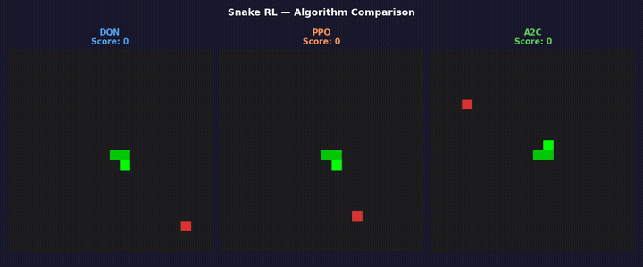
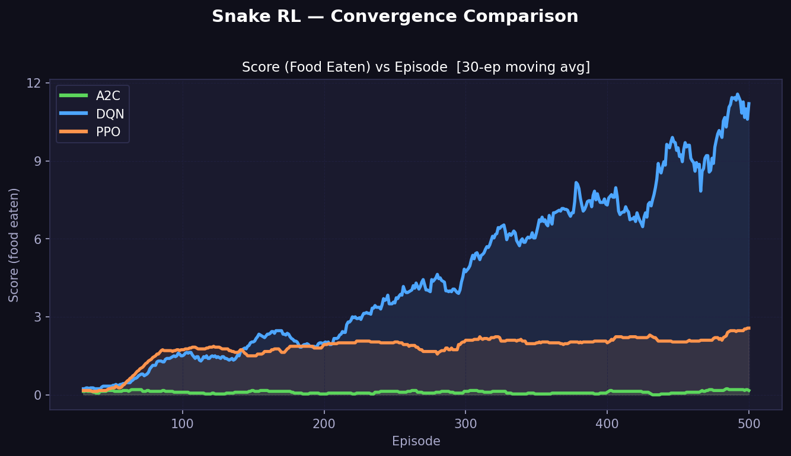

# Snake RL — DQN vs PPO vs A2C



I let 3 RL algorithms fight it out on a Snake game. Here's what I learned.

---

## Building the Environment

I used **PyTorch** and **Gymnasium** to simulate a 20×20 Snake grid environment. Gymnasium provided the standard env interface (`reset`, `step`, `observation`, `reward`) and PyTorch powered the neural networks behind each agent. The snake's entire world — grid state, food placement, and collision detection — was coded from scratch on top of this.

---

## Environment

**State** → 11-dimensional vector:
- 3 danger signals (is the next cell straight/right/left a wall or body?)
- 4 direction one-hot encodings (a binary vector with exactly one 1, e.g. heading RIGHT = `[0,1,0,0]`)
- 4 food-relative flags (is food above/below/left/right of the head?)

**Action** → 3 choices: go straight, turn left, turn right

**Reward** → `+10` for eating food, `-10` for dying, `0` otherwise

---

## Algorithms

**DQN (Deep Q-Network)**
Learns to estimate how good each action is from a given state using a neural network. A replay buffer stores past experiences and resamples them randomly, breaking correlations and stabilizing training.

**PPO (Proximal Policy Optimisation)**
Directly learns a policy that maps states to action probabilities. It clips updates so the policy never changes too drastically in one step, making convergence conservative but consistent.

**A2C (Advantage Actor-Critic)**
Uses two networks together — an Actor that picks actions and a Critic that estimates how good the current state is. The actor improves by taking actions that beat the critic's expectations, which is the "advantage."

---

## Training Results

Training: 500 episodes each on a 20×20 grid.

DQN converged steadily from the start. PPO was slow to pick up but showed a clear upward trend past episode 300. A2C flatlined throughout all 500 episodes.



| Algorithm | Convergence | Notes |
|---|---|---|
| DQN | Steady from early episodes | Best overall performer |
| PPO | Slow start, picks up after ep 300 | Consistent but conservative |
| A2C | Flatlined throughout | Single-env setup starves it |

---

## Why did A2C fail here?

A2C is built for **parallel environments**. It stabilizes learning by averaging gradients across many simultaneous agents — running it on a single environment starves it of that variance reduction.

With mostly sparse rewards throughout an episode, the Critic has almost nothing to learn from early on, so the Actor receives noisy gradient signals and never meaningfully improves.

A2C shines in multi-environment setups with dense rewards — robotics simulations, continuous control tasks, or any setting where feedback is frequent and you can run many instances in parallel.

---

## Project Structure

```
nokia_snake_game/
├── agents/
│   ├── __init__.py
│   ├── dqn_agent.py          # QNetwork, ReplayBuffer, DQNAgent
│   ├── ppo_agent.py          # ActorCritic, PPOAgent
│   └── a2c_agent.py          # ActorCritic, A2CAgent
├── env/
│   ├── __init__.py
│   └── snake_env.py          # Gymnasium-compatible Snake environment
├── scripts/
│   ├── train.py              # Single-algo DQN training loop
│   ├── train_all.py          # Train DQN + PPO + A2C and compare
│   ├── evaluate.py           # Terminal, video, and benchmark evaluation
│   ├── plot_convergence.py   # Convergence plot for all algorithms
│   └── record_comparison.py  # Side-by-side video of all agents
├── checkpoints/              # Saved model weights, training history, and plots
├── outputs/                  # Recorded MP4 videos
└── requirements.txt
```

---

## Setup

```bash
# Clone the repository
git clone https://github.com/m-varma1234/nokia_snake_game.git
cd nokia_snake_game

# Create and activate a virtual environment
python -m venv .venv
source .venv/bin/activate      # macOS/Linux
# .venv\Scripts\activate       # Windows

# Install dependencies
pip install -r requirements.txt
```

---

## Usage

All scripts are run from the **project root**.

### Train all three algorithms

```bash
python scripts/train_all.py --episodes 500
```

### Train DQN only

```bash
python scripts/train.py --episodes 500 --grid 20
```

### Plot convergence curves

```bash
python scripts/plot_convergence.py
# Output → checkpoints/convergence.png
```

### Evaluate a trained agent (terminal)

```bash
python scripts/evaluate.py --mode terminal --episodes 5
```

### Record an MP4

```bash
# Requires ffmpeg: brew install ffmpeg
python scripts/evaluate.py --mode video --output snake_play.mp4
```

### Record side-by-side comparison video

```bash
python scripts/record_comparison.py --output outputs/comparison.mp4
```

### Benchmark silently over N episodes

```bash
python scripts/evaluate.py --mode benchmark --episodes 100
```

---

## Training Options

### `scripts/train_all.py`

```
--episodes      int    Training episodes per algorithm  (default 1000)
--grid          int    Grid size N×N                    (default 20)
--algos         list   Algorithms to train              (default: dqn ppo a2c)
--save-dir      str    Checkpoint directory             (default checkpoints/)
--log-interval  int    Print stats every N episodes     (default 50)
```

### `scripts/train.py` (DQN only)

```
--episodes      int    Training episodes          (default 500)
--grid          int    Grid size N×N              (default 20)
--lr            float  Learning rate              (default 1e-3)
--gamma         float  Discount factor            (default 0.9)
--epsilon-start float  Starting exploration rate  (default 1.0)
--epsilon-end   float  Minimum exploration rate   (default 0.01)
--epsilon-decay float  Per-episode decay          (default 0.995)
--buffer        int    Replay buffer capacity     (default 100000)
--batch         int    Mini-batch size            (default 1000)
--target-update int    Target net sync frequency  (default 10)
--save-dir      str    Checkpoint directory       (default checkpoints/)
--log-interval  int    Print stats every N eps    (default 20)
```

---

## Outputs

```
checkpoints/
├── dqn_best.pt            # Best DQN checkpoint (highest 100-ep mean)
├── dqn_history.json       # Per-episode scores and steps
├── ppo_best.pt
├── ppo_history.json
├── a2c_best.pt
├── a2c_history.json
├── comparison_curves.png  # Score + steps comparison across algorithms
└── convergence.png        # Smoothed convergence plot

outputs/
└── comparison.mp4         # Side-by-side agent video
```

---

## Observation Space (11 floats)

| Index | Feature | Description |
|---|---|---|
| 0 | `danger_straight` | Is the cell directly ahead a wall or snake body? |
| 1 | `danger_right` | Same check one step to the right of current heading |
| 2 | `danger_left` | Same check one step to the left |
| 3–6 | `dir_up/right/down/left` | One-hot encoding of current heading |
| 7–10 | `food_up/right/down/left` | Is food in that cardinal direction relative to head? |

All values are binary floats (`0.0` or `1.0`).

---

## Stack

- Python 3.10+
- [PyTorch](https://pytorch.org/) — neural networks and training
- [Gymnasium](https://gymnasium.farama.org/) — RL environment interface
- NumPy, Matplotlib
- ffmpeg (optional, for video recording)
